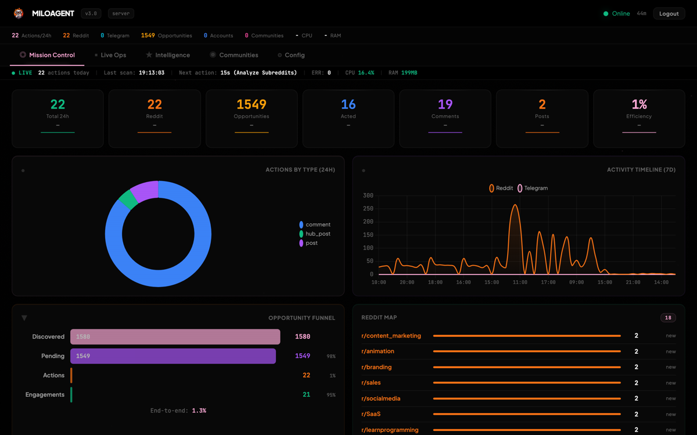
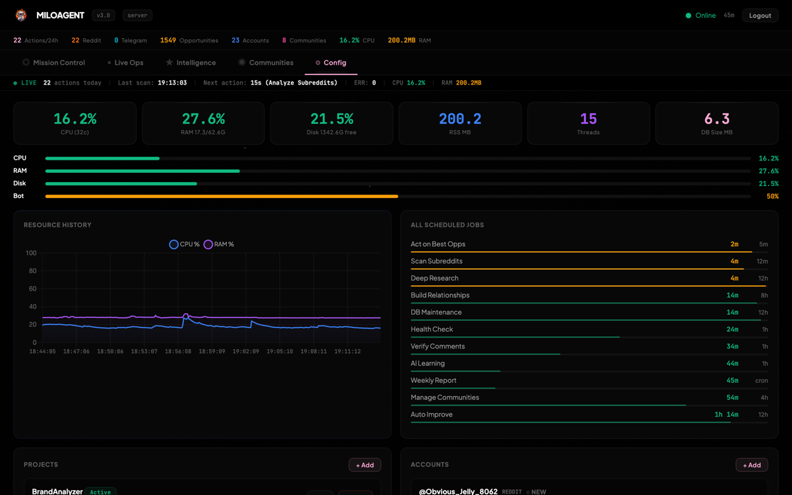
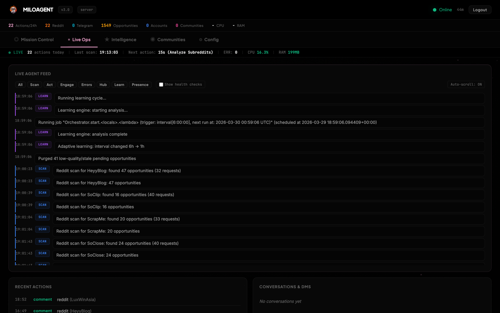
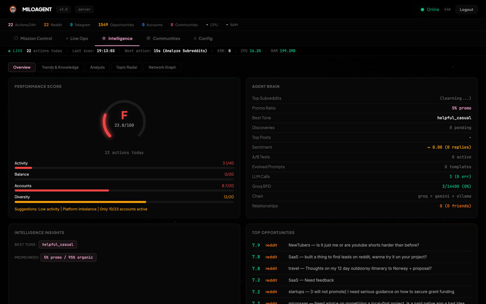
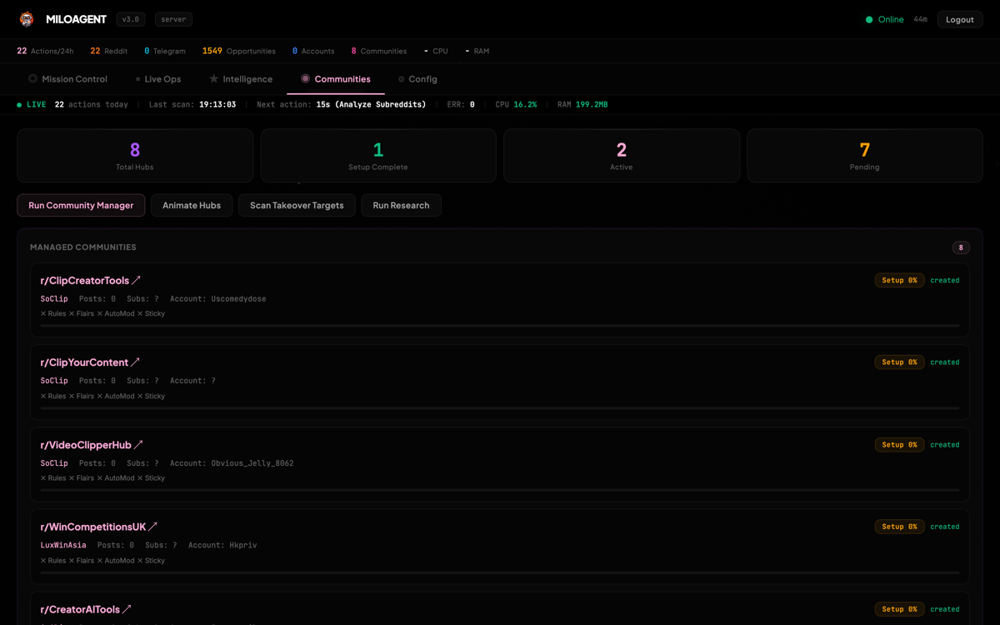
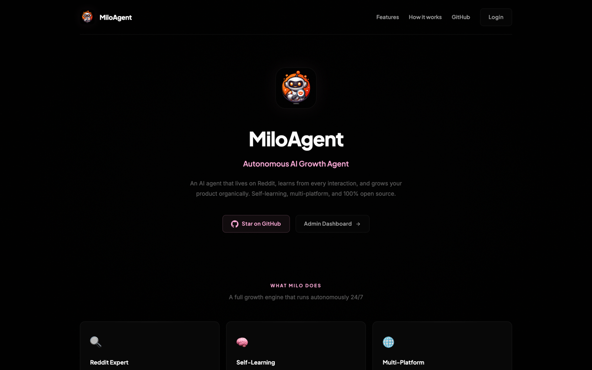

<p align="center">
  
</p>

<h1 align="center">MiloAgent -- Autonomous AI Growth Agent</h1>

<p align="center">
  <strong>An AI agent that lives on Reddit, learns from every interaction, and grows your product organically.</strong><br>
  <em>Self-learning, multi-account, multi-project, zero-cost.</em>
</p>

<p align="center">
  
  
  
  
  
  
</p>

---

## Dashboard

<p align="center">
  
</p>

<details>
<summary><strong>More screenshots</strong></summary>

<br>

| Accounts & Karma Tiers | Live Action Feed |
|:-:|:-:|
|  |  |

| Opportunity Queue | Performance & Insights |
|:-:|:-:|
|  |  |

| Projects Management | Telegram Dashboard |
|:-:|:-:|
|  |  |

</details>

---

## What is MiloAgent?

**Milo** is not a script. He's an autonomous AI agent.

He reads Reddit like a human. He understands what people are asking, what tone fits each community, and when your product is genuinely the right answer. He crafts responses that sound like they come from someone who actually uses your product -- because his LLM brain has memorized every feature, every FAQ, every competitor difference.

And he **learns**. Every comment he posts, every upvote or removal he gets back, feeds his learning engine. He figures out which subreddits love him, which keywords work, which tone gets engagement, and which approach gets deleted. Then he adapts.

### Why MiloAgent?

| | Traditional bots | **MiloAgent** |
|---|---|---|
| **Content** | Templates + spam | LLM-generated, context-aware, adapted per community |
| **Strategy** | Fixed rules | Self-learning: adjusts targeting, tone, timing automatically |
| **Detection** | Gets banned fast | Expert personas, human timing, shadowban detection, circuit breakers |
| **Scale** | 1 account | Multi-account rotation, karma-tiered daily caps |
| **Cost** | API fees | **$0/month** -- runs on free-tier LLMs |
| **Intelligence** | None | A/B testing, prompt evolution, sentiment analysis |

---

## Architecture

```
                    +---------------------------+
                    |       ORCHESTRATOR        |
                    |    APScheduler Jobs       |
                    |  Scan / Act / Learn / ... |
                    +------------+--------------+
                                 |
              +------------------+------------------+
              |                  |                   |
     +--------v-------+  +------v--------+  +-------v-------+
     |  LLM ENGINE    |  |  SAFETY LAYER |  |   LEARNING    |
     |  Groq (free)   |  |  Rate limiter |  |   A/B tests   |
     |  Gemini (free) |  |  Ban detector |  |   Weights     |
     |  Ollama (local)|  |  Circuit break|  |   Prompt evo  |
     +--------+-------+  |  Dedup        |  |   Sentiment   |
              |           |  Karma tiers  |  +-------+-------+
              |           +------+--------+          |
              |                  |                    |
              +------------------+--------------------+
                                 |
              +------------------+------------------+
              |                  |                   |
     +--------v-------+  +------v--------+  +-------v-------+
     |    REDDIT      |  |   TWITTER     |  |   TELEGRAM    |
     |  Cookie auth   |  |  (learning)   |  |  (learning)   |
     |  Parallel scan |  |               |  |               |
     |  Comment/Post  |  |               |  |               |
     |  Hub mgmt      |  |               |  |               |
     +----------------+  +---------------+  +---------------+
              |
     +--------v-----------+
     |    DASHBOARD        |
     |  Web (FastAPI)      |
     |  Terminal (TUI)     |
     |  Telegram bot       |
     +---------------------+
```

### Milo's Cycle

```
SCAN  -->  Find relevant posts where your product fits naturally
  |
SCORE -->  Rank by relevance x freshness x engagement potential
  |
THINK -->  Pick persona + tone for this specific subreddit
  |
WRITE -->  LLM generates human-like comment (80% helpful / 20% promo)
  |
CHECK -->  Validate: no spam patterns, no duplicates, no banned phrases
  |
POST  -->  Publish with human-like delays
  |
LEARN -->  Track outcome: upvotes? replies? removed? --> adjust strategy
```

---

## Features

### Multi-Account Karma Tier System
Accounts automatically unlock more capacity as their karma grows:

| Tier | Karma | Daily Cap | Posts Allowed |
|------|-------|-----------|---------------|
| New | < 10 | 3/day | Comments only |
| Growing | 10-50 | 7/day | Yes |
| Established | 50-200 | 12/day | Yes |
| Veteran | 200+ | 20/day | Priority |

### Parallel Scanning
All projects scan concurrently using a thread pool. 8 projects complete in ~3 minutes instead of 24+ minutes sequentially.

### Self-Learning Engine
- **Performance weighting** -- subreddits/keywords scored by real engagement
- **Sentiment analysis** -- detects positive/negative replies, adjusts tone
- **A/B testing** -- tests tone, length, post type, promo ratio
- **Prompt evolution** -- rewrites its own LLM prompts based on top-performing content

### Safety System
| Protection | How it works |
|-----------|-------------|
| Rate limiting | Per-account + per-subreddit + per-hour limits |
| Human timing | Random delays, jitter, no detectable patterns |
| Shadowban detection | Profile visibility checks |
| Circuit breaker | Auto-pause on consecutive failures |
| User-Agent rotation | 11 realistic browser signatures |
| Content validation | Pre-post check for spam, duplicates, banned phrases |
| Karma gate | Blocks accounts with negative karma from writing |
| CAPTCHA detection | Cross-account cooling when CAPTCHAs detected |

### Zero-Cost LLM Stack

| Provider | Model | Limit | Role |
|----------|-------|-------|------|
| Groq | Llama 3.3 70B | 6,000 req/day | Primary |
| Google Gemini | 2.0 Flash | 1,500 req/day | Fallback |
| Ollama | Any local model | Unlimited | Local fallback |

Automatic failover: Groq --> Gemini --> Ollama. Circuit breakers prevent cascading failures.

---

## Quick Start

### Prerequisites
- Python 3.10+
- A free [Groq API key](https://console.groq.com) or [Gemini API key](https://aistudio.google.com/apikey)
- At least one Reddit account

### Installation

```bash
git clone https://github.com/SoCloseSociety/MiloAgent.git
cd MiloAgent

python3 -m venv .venv
source .venv/bin/activate

pip install -r requirements.txt
```

### Configuration

All config files use template/override pattern: edit `config/*.yaml` templates, or copy to `config/*.local.yaml` for production (gitignored).

**1. LLM provider** -- `config/llm.yaml`:
```yaml
providers:
  groq:
    api_key: "gsk_your_key_here"    # Free at https://console.groq.com
```

**2. Reddit account** -- `config/reddit_accounts.yaml`:
```yaml
accounts:
  - username: "your_reddit_username"
    password: "your_password"
    enabled: true
    assigned_projects: ["my_project"]
```

**3. Your project** -- copy and customize:
```bash
cp projects/example_project.yaml projects/my_project.yaml
nano projects/my_project.yaml
```

**4. Login & launch**:
```bash
python3 miloagent.py login reddit    # Opens browser, captures cookies
python3 miloagent.py test all        # Verify all connections
python3 miloagent.py run             # Start Milo
```

---

## Docker Deployment

```bash
cp .env.example .env
nano .env                    # Set your credentials

docker compose up -d
docker compose logs -f
```

### VPS Deployment

```bash
./deploy.sh --setup    # First-time: Nginx + SSL + systemd
./deploy.sh --up       # Build & start
./deploy.sh --update   # Pull + rebuild + restart
./deploy.sh --status   # Health check
```

---

## Dashboards

### Web Dashboard (FastAPI)
```bash
python3 miloagent.py run --web    # Port 8420
```
Full browser UI: real-time stats, action feed, account management, project CRUD, opportunity queue, performance insights, network graph, live logs via WebSocket.

### Terminal Dashboard (TUI)
```bash
python3 miloagent.py dashboard
```
| Key | Action |
|-----|--------|
| `TAB` / `1-4` | Switch views |
| `s` Scan / `a` Act / `l` Learn / `e` Engage |
| `p` Pause/Resume / `q` Quit |

### Telegram Dashboard
Control Milo from your phone:

| Command | Description |
|---------|-------------|
| `/status` | Current state, RAM, recent actions |
| `/stats` | 24h performance stats |
| `/report` | Full daily report |
| `/insights` | Learning insights |
| `/scan` / `/post` | Trigger manually |
| `/pause` / `/resume` | Pause/resume |

---

## Automated Jobs

| Job | Frequency | Description |
|-----|-----------|-------------|
| **Scan** | 12 min | Find opportunities (parallel, all projects) |
| **Act** | 5 min | Comment on best-scored opportunity |
| **Engage** | 2h | Organic upvotes, subscribes |
| **Verify** | 1h | Check if comments survived moderation |
| **Seed Content** | 6h | Create original posts |
| **Learn** | 6h | Analyze results, adjust weights |
| **Auto-Improve** | 12h | Evolve prompts, optimize strategy |
| **Health Check** | 30 min | Detect shadowbans, verify accounts |
| **Research** | 4h | Track trends for better content |
| **Hub Animation** | 6h | Manage owned subreddits |
| **Karma Refresh** | 12h | Update account karma cache |
| **Daily Report** | 24h | Telegram summary |

---

## Project Structure

```
MiloAgent/
|-- miloagent.py              # CLI entry point
|-- requirements.txt
|-- Dockerfile / docker-compose.yml
|-- deploy.sh                 # VPS deployment script
|-- miloagent.service         # Systemd unit
|
|-- config/                   # Configuration (*.local.yaml = gitignored)
|   |-- settings.yaml         # Behavior, limits, features
|   |-- llm.yaml              # LLM provider keys
|   |-- reddit_accounts.yaml  # Reddit credentials
|   |-- reddit_api.yaml       # OAuth2 app credentials
|   |-- telegram.yaml         # Telegram bot token
|   +-- expert_personas.yaml  # Persona library
|
|-- core/                     # Brain
|   |-- orchestrator.py       # Job scheduler + parallel scans
|   |-- content_gen.py        # LLM content generation
|   |-- llm_provider.py       # Multi-provider LLM with failover
|   |-- learning_engine.py    # Self-improvement
|   |-- strategy.py           # Opportunity scoring
|   |-- ab_testing.py         # A/B experiments
|   |-- database.py           # SQLite WAL
|   +-- ...
|
|-- platforms/                # Platform integrations
|   |-- reddit_web.py         # Reddit (cookie auth, expert)
|   |-- twitter_bot.py        # Twitter/X
|   +-- telegram_group_bot.py # Telegram
|
|-- safety/                   # Protection layer
|   |-- rate_limiter.py
|   |-- ban_detector.py
|   |-- content_dedup.py
|   |-- account_manager.py    # Karma tiers + rotation
|   +-- captcha_solver.py     # ddddocr auto-solver
|
|-- dashboard/                # Monitoring
|   |-- web.py                # FastAPI web dashboard
|   |-- tui.py                # Terminal dashboard
|   |-- telegram_bot.py       # Telegram bot dashboard
|   +-- static/               # Frontend (HTML/JS/CSS)
|
|-- prompts/                  # LLM prompt templates
|-- projects/                 # Product configs (gitignored, example in repo)
+-- data/                     # Runtime data (gitignored)
```

---

## CLI Reference

| Command | Description |
|---------|-------------|
| `run [--daemon] [--web]` | Start Milo |
| `stop` | Stop daemon |
| `dashboard` | Terminal UI |
| `scan reddit` | Manual scan |
| `post reddit -p <project>` | Manual comment |
| `engage all` | Organic engagement |
| `login reddit` | Browser cookie login |
| `paste-cookies reddit` | Manual cookie paste |
| `test all` | Test all connections |
| `status` / `stats` | Monitoring |
| `accounts` | Account health |
| `learn` / `insights` | Learning system |
| `business list\|add\|show` | Project management |
| `hub list\|create` | Subreddit management |

---

## Contributing

Contributions welcome! Some ideas:
- New platform integrations (LinkedIn, Discord, ...)
- Better prompt templates
- Dashboard improvements
- Safety enhancements
- Documentation

---

## License

MIT License -- see [LICENSE](LICENSE) for details.

---

<p align="center">
  <br>
  <strong>Milo never sleeps. He scans, he learns, he grows your product.</strong><br>
  <sub>Built by <a href="https://github.com/SoCloseSociety">SoCloseSociety</a></sub>
</p>
